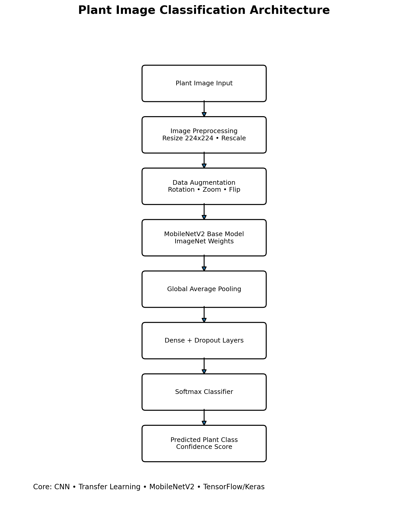
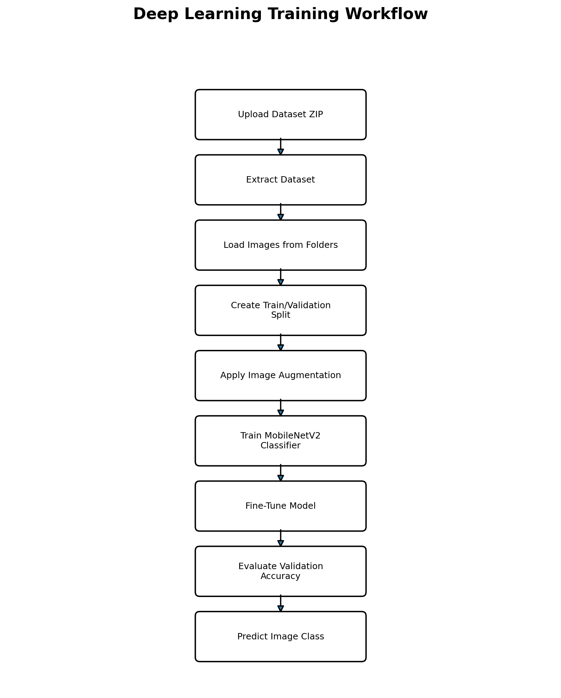
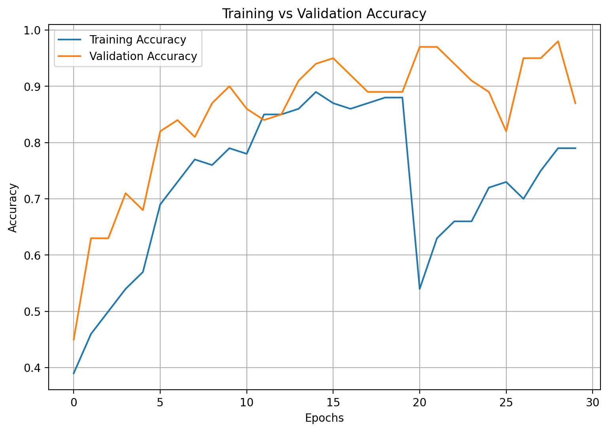

# Plant Image Classification using Deep Learning and MobileNetV2

A deep learning-based plant image classification system built using TensorFlow, Keras, CNNs, and MobileNetV2 transfer learning. The model is trained using image augmentation and fine-tuning to classify plant images with confidence scores.

---

## Project Overview

This project demonstrates how Convolutional Neural Networks (CNNs) and transfer learning can be used for plant image classification.

The model uses **MobileNetV2**, a pre-trained deep learning architecture, as the feature extractor. A custom classification head is added on top of MobileNetV2 to classify plant images into different categories.

The project includes:

- Dataset extraction and preparation
- Image preprocessing
- Data augmentation
- Transfer learning using MobileNetV2
- Model training
- Fine-tuning
- Validation accuracy tracking
- Image prediction with confidence score

---

## Key Features

- Plant image classification using deep learning
- Transfer learning with MobileNetV2
- TensorFlow and Keras-based training pipeline
- Image augmentation for better generalization
- Training and validation accuracy visualization
- Fine-tuning for improved performance
- Prediction output with confidence percentage
- Google Colab-compatible notebook

---

## Architecture Diagram



---

## Workflow Diagram



---

## Demo Output


---

## Model Performance



---

## Dataset

The dataset is loaded from a zipped dataset file and extracted inside Google Colab.

The dataset follows a directory-based class structure:

```text
dataset/
├── class_1/
├── class_2/
├── class_3/
└── ...
```

Each folder represents one plant class.

---

## Technologies Used

### Programming Language

- Python

### Deep Learning

- TensorFlow
- Keras
- MobileNetV2
- Convolutional Neural Networks
- Transfer Learning

### Data Processing

- NumPy
- OpenCV
- ImageDataGenerator

### Visualization

- Matplotlib

### Development Environment

- Google Colab
- Git
- GitHub

---

## Model Architecture

The model architecture includes:

```text
Input Image (224x224x3)
        ↓
MobileNetV2 Base Model
        ↓
Global Average Pooling
        ↓
Dense Layer with ReLU
        ↓
Dropout Layer
        ↓
Softmax Output Layer
        ↓
Predicted Plant Class
```

---

## Training Pipeline

### 1. Dataset Extraction

The dataset is extracted from a ZIP file.

### 2. Image Preprocessing

Images are resized to:

```text
224 x 224
```

and pixel values are normalized.

### 3. Data Augmentation

The following augmentation techniques are applied:

- Rotation
- Zoom
- Horizontal Flip
- Rescaling

### 4. Transfer Learning

MobileNetV2 is loaded with ImageNet weights and used as the base model.

### 5. Initial Training

The base model is frozen, and only the custom classifier layers are trained.

### 6. Fine-Tuning

The base model is unfrozen and trained with a lower learning rate.

### 7. Evaluation

The model is evaluated using validation accuracy.

### 8. Prediction

A test image is passed to the trained model to generate:

- Predicted class
- Confidence score

---

## Project Structure

```text
Plant-Image-Classification-using-Deep-Learning/
│
├── README.md
├── LICENSE
├── requirements.txt
├── plant_classification_training.ipynb
├── app.py
├── architecture.png
├── workflow.png
├── demo.png
└── model-performance.png
```

---

## Installation

### 1. Clone the Repository

```bash
git clone https://github.com/VishwaSabaris/Plant-Image-Classification-using-Deep-Learning.git
cd Plant-Image-Classification-using-Deep-Learning
```

### 2. Install Dependencies

```bash
pip install -r requirements.txt
```

---

## Usage

### Run Training Notebook

Open the notebook in Google Colab:

```text
plant_classification_training.ipynb
```

Upload your dataset ZIP file and run each cell.

### Run Python Script

```bash
python app.py
```

---

## Results

The model predicts plant classes with confidence score.

Example:

```text
Prediction: CROWFOOT GRASS
Confidence: 92.41%
```

---

## Skills Demonstrated

- Deep Learning
- Computer Vision
- CNN Architecture
- Transfer Learning
- MobileNetV2
- TensorFlow and Keras
- Image Preprocessing
- Image Augmentation
- Model Training
- Fine-Tuning
- Model Evaluation
- Prediction Visualization

---

## Future Improvements

- Add Streamlit web interface
- Add real-time camera prediction
- Deploy on Streamlit Cloud
- Deploy using Docker
- Add confusion matrix
- Add classification report
- Add Grad-CAM visualization
- Add support for plant disease detection
- Save and load trained model using `.h5` or SavedModel format
- Improve dataset quality and class balance

---

## Learning Outcomes

Through this project, I learned:

1. How CNN-based image classification works
2. How transfer learning improves model performance
3. How to use MobileNetV2 for image classification
4. How to preprocess and augment image datasets
5. How to train and fine-tune deep learning models
6. How to evaluate training and validation performance
7. How to generate predictions with confidence scores
8. How to build a computer vision portfolio project

---

## Author

**Vishwa Sabaris V**

B.E. Computer Science and Engineering (Artificial Intelligence & Machine Learning)

Kalaignar Karunanidhi Institute of Technology (KIT), Coimbatore

---

## License

This project is licensed under the MIT License.
